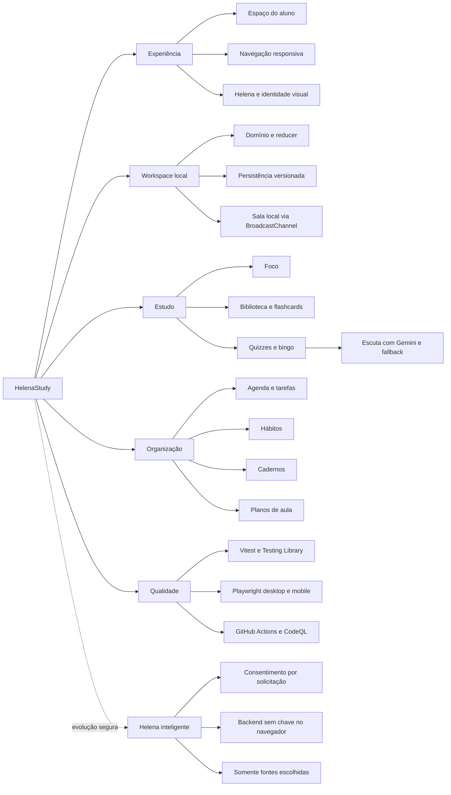

# HelenaStudy: Second Brain

## Proposta

O HelenaStudy é o segundo aplicativo da marca Oli. Ele reúne organização, foco, rotina e
aprendizado em um único espaço, preservando o planejador de aulas de inglês como uma ferramenta do
produto.

**Promessa:** Estude, organize e avance com a Helena.

## Público inicial

- estudantes que desejam organizar rotina e matérias;
- professores de inglês e professores particulares;
- pessoas que precisam reunir tarefas, foco, hábitos e anotações.

## Fluxo atual

1. Consultar tarefas, agenda, hábitos e minutos de foco no Espaço do aluno.
2. Criar matérias, tarefas e compromissos na Agenda.
3. Registrar sessões no cronômetro de Foco.
4. Criar e marcar Hábitos diários.
5. Escrever, desenhar ou anexar uma digitalização nos Cadernos.
6. Guardar links, textos e flashcards por matéria na Biblioteca.
7. Revisar flashcards, responder Quizzes, completar Bingos e acompanhar metas em Praticar.
8. Praticar escuta em rodadas curtas com voz Gemini e fallback do dispositivo.
9. Criar uma Sala local e sincronizar o lobby entre abas do mesmo navegador.
10. Montar planos de aula pelo fluxo determinístico existente.

Todos esses dados compartilham um workspace local versionado. Não há conta, banco ou sincronização
remota. Somente o texto da pergunta de escuta sai do dispositivo quando a voz Gemini é usada.

## Arquitetura atual

- React 19 e TypeScript estrito;
- Vite para desenvolvimento e build;
- CSS próprio, mobile-first e sem fonte externa;
- interface com hierarquia de próxima ação, cartões de progresso, ícones ilustrados preenchidos e
  movimentos curtos compatíveis com `prefers-reduced-motion`;
- Vitest e Testing Library para unidade/componente;
- Playwright para fluxos desktop e mobile;
- GitHub Actions para qualidade, auditoria, segredos, análise estática e CodeQL.
- Gemini 2.5 Flash TTS chamado por função same-origin, sem expor a chave no navegador;
- cache de áudio por texto, voz e velocidade durante a sessão, com fallback imediato para a voz do
  dispositivo;
- BroadcastChannel como transporte explícito do protótipo de Sala local.

## Mapa mental vivo

Este diagrama funciona como a rede de navegação do repositório: parte da experiência HelenaStudy e
liga cada área do produto à sua base técnica e às garantias de qualidade.

Ao alterar uma área, atualize o nó correspondente e os fluxos ligados a ele. Detalhes de produto
continuam em [`PRODUCT_MIND_MAP.md`](PRODUCT_MIND_MAP.md); este mapa serve como visão executiva do
sistema completo.

## Etapas do produto

1. **Núcleo local concluído:** Espaço do aluno, Agenda, Foco, Hábitos, Cadernos e planos de aula.
2. **Sistema de estudos em evolução:** biblioteca, flashcards, revisão programada, quizzes, bingo,
   metas, digitalização local e escrita à mão estão funcionais. OCR e banco de questões ainda não.
3. **Helena inteligente com fundação definida:** contrato, consentimento e fronteira segura do
   backend estão prontos; provedor e interface ainda não estão ativados. Depois entram tutor,
   explicações, resumos e planos personalizados.
4. **Aplicativo mobile:** notificações, sincronização e controle nativo de tempo de tela.

As etapas 2 a 4 entram em mudanças próprias. IA e armazenamento remoto exigem consentimento,
modelo de ameaça e documentação do fluxo de dados. O bloqueio de outros aplicativos não deve ser
simulado em uma aplicação web.

A definição do backend de IA está em [`AI_BACKEND.md`](AI_BACKEND.md). O contrato envia somente
fontes escolhidas pela pessoa e exige consentimento a cada solicitação. Nenhuma chave pode existir
no bundle do navegador.

## Identidade

- preto: `#17151C`;
- amarelo: `#FFC94A`;
- violeta: `#7257E8`;
- lavanda: `#E9E2FF`;
- creme: `#FFF8ED`.

Helena é a gata preta de olhos amarelos que orienta o fluxo. O aplicativo usa a silhueta
assimétrica original em `public/helena.svg`, sem redesenhar a personagem como um gato genérico. O
nome exibido na interface é somente HelenaStudy. A navegação usa uma família própria de ícones SVG
lineares, com selos amarelos e traços pretos para manter contraste e consistência sem carregar um
pacote de ícones adicional. A interface usa a navegação escura como ponto de apoio, conteúdo em
creme, superfícies claras e lavanda para contexto. As animações são curtas e reduzidas quando o
sistema solicita menos movimento.

## Fora do escopo desta fase

- login e cadastro;
- banco de dados e colaboração;
- geração por IA;
- upload e leitura automática de PDF/livros;
- pagamentos;
- exportação final em PDF ou slides;
- acompanhamento de alunos;
- bloqueio de outros aplicativos;
- notificações nativas.

Cada item entra apenas quando o fluxo local básico estiver validado.

O mapa completo do produto está em [`PRODUCT_MIND_MAP.md`](PRODUCT_MIND_MAP.md), e a ordem de
implementação com critérios técnicos está em [`IMPLEMENTATION_ROADMAP.md`](IMPLEMENTATION_ROADMAP.md).

# Decisão de interface: navegação lateral

O menu lateral concentra a troca de módulos no desktop. O Espaço do aluno não repete essa lista:
mantém apenas ações contextuais e o resumo do dia. Em telas móveis, a barra inferior e o menu “Mais
ferramentas” preservam o acesso completo.
